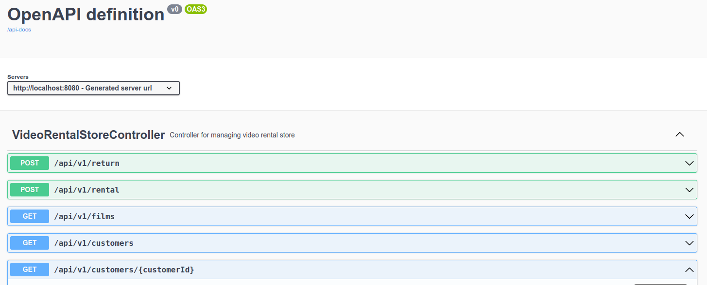

# Video Rental Store

## Descripción del Proyecto

Este proyecto es un sistema de administración de alquileres para una tienda de alquiler de videos. El sistema permite gestionar el inventario de películas, calcular el precio de los alquileres y llevar un registro de los puntos de bonificación de los clientes.

## Arquitectura

El proyecto sigue el patrón de arquitectura MVC (Model-View-Controller):

- **Model**: Representa los datos y la lógica de negocio. Incluye las clases de dominio
- **Controller**: Gestiona las solicitudes HTTP y coordina las respuestas. Utiliza los servicios para realizar operaciones de negocio.
- **Service**: Contiene la lógica de negocio y se comunica con los DAOs para acceder a los datos.

## Patrones de Diseño Utilizados

### Strategy Pattern

**Propósito**: Permite definir una familia de algoritmos, encapsular cada uno de ellos y hacerlos intercambiables.

**Implementación**: Se ha creado una interfaz `PricingStrategy` y clases concretas para cada tipo de película (`NewReleasePricingStrategy`, `RegularFilmPricingStrategy`, `OldFilmPricingStrategy`).

```java
public interface PricingStrategy {
    double calculatePrice(int daysRented);

    double calculateLateCharge(int daysLate);

    int getBonusPoints();
}
```

### Factory Pattern

**Propósito**: Proporciona una interfaz para crear objetos en una superclase, pero permite a las subclases alterar el tipo de objetos que se crearán.

**Implementación**: Se ha creado una `PricingStrategyFactory` que devuelve la estrategia de precios adecuada según el tipo de película.

```java
public class PricingStrategyFactory {
  public static PricingStrategy getPricingStrategy(FilmTypeEnum type) {
    return switch (type) {
      case NEW_RELEASE -> new NewReleasePricingStrategy();
      case REGULAR_RENTAL -> new RegularFilmPricingStrategy();
      case OLD_FILM -> new OldFilmPricingStrategy();
      default -> throw new VideoRentalStoreException(VideoRentalStoreException.FILM_TYPE_UNKNOW, type.name());
    };
  }
}
```


## Tecnologías Utilizadas

- Java 17
- Spring Boot
- Maven
- H2 Database
- Lombok
- Swagger
- JUnit 5
- Mockito
- Docker


## Visualización de la Base de Datos
```bash
http://localhost:8080/h2-console
```

## Ejecución del Proyecto

1. Clonar el repositorio.
```bash
git@github.com:EnriqueRS/videorentalstore.git
```
2. Navegar al directorio del proyecto.
3. Ejecutar `mvn clean install` para construir el proyecto.
4. Ejecutar `mvn spring-boot:run` para iniciar la aplicación.

## Docker

Para ejecutar la aplicación en un contenedor de docker, se debe ejecutar el siguiente comando:

```bash
 docker build -t videorentalstore .
```

```bash
docker run -p 8080:8080 videorentalstore
```

## Endpoints de la API

Se ha añadido la documentación de la API con OpenAPI. Para acceder a ella, se debe ir a la siguiente
URL:

```bash
http://localhost:8080/swagger-ui.html
```

~~~~

## Ejemplos de Uso

### Alquilar Películas

POST /rent
```json
{
  "customerId": 1,
  "films": [
    {
      "title": "Matrix 11",
      "days": 1
    },
    {
      "title": "Spider Man",
      "days": 5
    },
    {
      "title": "Spider Man 2",
      "days": 2
    },
    {
      "title": "Out of Africa",
      "days": 7
    }
  ]
}
```

### Devolver Películas

POST /return
```json
{
  "films": [
    {
      "title": "Matrix 11",
      "daysDelayed": 2
    },
    {
      "title": "Spider Man",
      "daysDelayed": 1
    }
  ]
}
```
